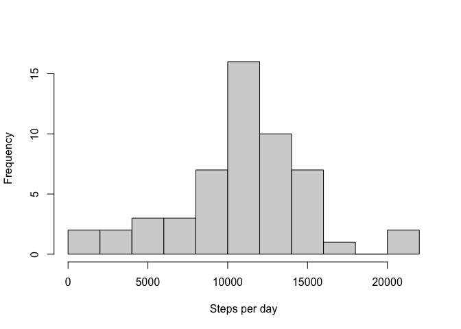
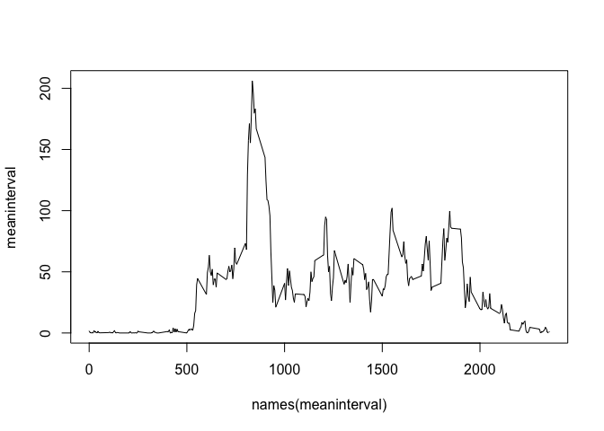
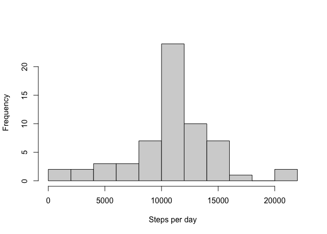
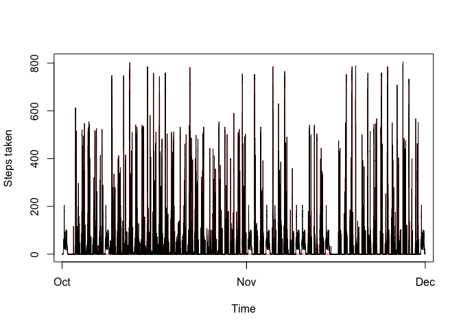
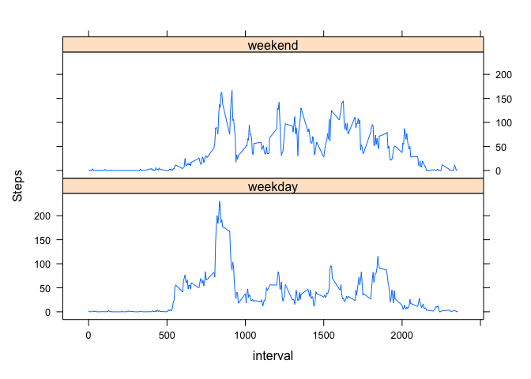

## Loading and preprocessing the data

##### Load activity data


```r
activity <- read.csv(file = "activity.csv")
```


##### Query data structure


```r
str(activity)
```

```
## 'data.frame':	17568 obs. of  3 variables:
##  $ steps   : int  NA NA NA NA NA NA NA NA NA NA ...
##  $ date    : chr  "2012-10-01" "2012-10-01" "2012-10-01" "2012-10-01" ...
##  $ interval: int  0 5 10 15 20 25 30 35 40 45 ...
```
##### Clean activity data

Remove all rows which steps data is NA stored in `act2`


```r
act2 <- activity[!is.na(activity$steps),]
```

## What is mean total number of steps taken per day?

##### Histogram of the total number of steps taken each day.


```r
stepsday <- with(act2,tapply(steps, date, sum))
hist(stepsday,xlab = "Steps per day",main = "",breaks = 10)
```

<!-- -->

##### Mean and median number of steps taken each day

Mean steps per day 10766.19  
Median steps per day 10765

## What is the average daily activity pattern?

##### Time series plot of the average number of steps taken


```r
meaninterval <- with(act2,tapply(steps, interval, mean))
plot(names(meaninterval),meaninterval,type = "l")
```

<!-- -->

```r
maxpeak = meaninterval[which.max(meaninterval)]
```

Max average steps occurs at interval 835 and is 206.17.

## Imputing missing values

#### Impute missing data

2304 out of 17568 steps observations are NAs in the steps column.


Impute missing values using interval means computed from activity data with NAs removed.

Function `intervalmean` is a helper function to `apply`. Determining if steps column is NA and looking up
imputed value from `meaninterval` if TRUE else returning steps.


```r
intervalmean<-function(x) {
  if (is.na(x[1])) {
    return(unname(meaninterval[x[3]]))
  } else {
    return(x[1])
  }
}
activity2 <- activity
activity2$interval <- as.character(activity2$interval)
activity2$impute <- apply(activity2,1,intervalmean)
activity2$impute <- as.integer(activity2$impute)
```


##### Histogram of steps per day with imputed day


```r
stepsday2 <- with(activity2,tapply(impute, date, sum))
hist(stepsday2, xlab = "Steps per day",breaks = 10,main = "")
```

<!-- -->

##### Recalculate means and medians

The imputed data has:  
mean = 10749.77 and median = 10641  
Which compared to the orginal data:  
mean = 10766.19 and median = 10765

##### Time series plots of imputed and original data


```r
library(stringr)

act2$datetime <- str_pad(act2$interval, 4, pad = "0")
act2$datetime <- paste(act2$date,act2$datetime)
act2$datetime <- strptime(act2$datetime,format = "%Y-%m-%d %H%M")

activity2$datetime <- str_pad(activity2$interval, 4, pad = "0")
activity2$datetime <- paste(activity2$date,activity2$datetime)
activity2$datetime <- strptime(activity2$datetime,format = "%Y-%m-%d %H%M")

plot(act2$datetime,act2$steps,type = "l",col="red",xlab = "Time",ylab = "Steps taken")
points(activity2$datetime,activity2$impute,col = "black",type = "l",)
```

<!-- -->

Imputed data is clearly visible at the being of the time series and occurs again a week to October.
Additionally at being of November and for many days in first two weeks of November and finally last day of November.

## Are there differences in activity patterns between weekdays and weekends?

#### Factor dates to weekend and weekday

Weekend days are determined `weekend` helper function. This use the `$wday` parameter of datetime which if equal to 0 or 6 (Sunday or Saturday) returns "weekend" else "weekday".


```r
weekend <- function(x) {
  if (x$wday %in% c(0,6)) {
    return("weekend")
  } else {
    return("weekday")
  }
}

activity2$weekend <- sapply(activity2$datetime,weekend)
activity2$weekend <- factor(activity2$weekend)
```

#### Panel plots of time series of mean intervals across weekdays and weekend days


```r
activity2$interval <- as.integer(activity2$interval)
meaninterval2 <- with(activity2,tapply(impute, list(interval,weekend), mean))
meaninterval2 <- as.data.frame(meaninterval2)
meaninterval2$interval <- row.names(meaninterval2)

library(tidyr)
pdata <- meaninterval2 %>% gather(Day,Steps,-interval)
pdata$interval <- as.integer(pdata$interval)

library(lattice)
xyplot(Steps ~ interval | Day,pdata,type = "l", layout = c(1,2))
```

<!-- -->

